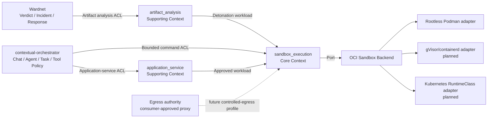
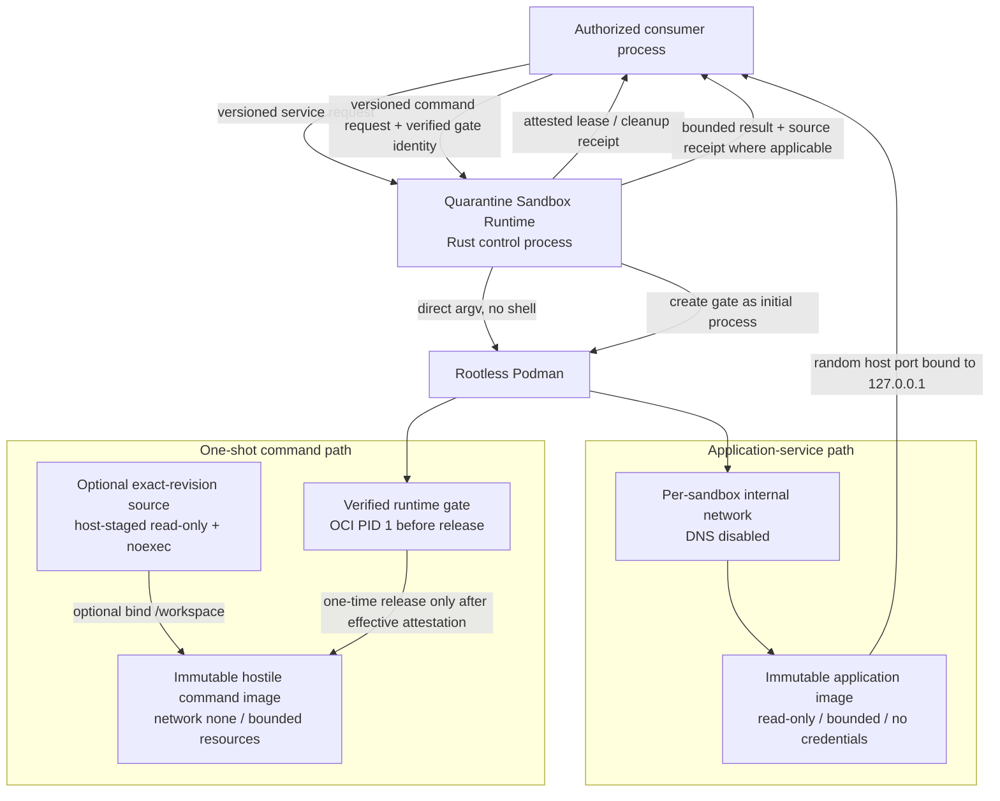

# Architecture

## Architectural goal

Provide one reusable, independently deployable isolation runtime that can safely execute **hostile analysis workloads**, **bounded one-shot commands**, and **consumer-approved application services** without absorbing consumer business authority.

## Bounded contexts

### `sandbox_execution` — Core subdomain

Ubiquitous Language:

- **Isolation Policy:** operator-owned maximum authority/resource envelope.
- **Resource Request:** consumer-requested resources constrained by policy.
- **Sandbox:** one isolated workload instance.
- **Command Execution:** one bounded direct-argv invocation that terminates with an evidence-bearing result.
- **Runtime Gate:** runtime-owned executable that remains the initial container process until effective isolation is attested and a one-time release is authorized.
- **Lease:** time-bounded evidence that a ready sandboxed service exists.
- **Endpoint:** consumer-visible loopback address for a leased application service.
- **Isolation Attestation:** runtime facts about the security boundary actually requested/enforced by the profile.
- **Cleanup Receipt:** evidence that runtime-owned container/network resources were removed.

Responsibilities:

- validate isolation policy/resource budget;
- create/identify sandbox resources;
- supervise command or service lifetime/readiness;
- keep hostile command argv non-runnable until the runtime-owned gate has passed effective-isolation attestation;
- produce command results, endpoint/lease state, attestation, and cleanup evidence;
- isolate backend implementation behind the runtime boundary.

### `artifact_analysis` — Supporting subdomain

Ubiquitous Language:

- **Artifact:** immutable hostile bytes.
- **Analysis Profile:** requested static/dynamic analysis depth.
- **Analyzer:** one evidence producer.
- **Evidence Bundle:** ordered deterministic evidence plus completeness.
- **Runtime Disposition:** completed/inconclusive/failed analysis completeness, never maliciousness.

Responsibilities:

- bounded ingestion and immutable identity;
- non-executing format classification;
- analyzer orchestration;
- attributable analyzer failures;
- future detonation requests through `sandbox_execution`.

### `application_service` — Supporting subdomain

Ubiquitous Language:

- **Application Service Request:** consumer-neutral intent to start one authorized immutable OCI image.
- **Service Lease:** ready loopback endpoint plus runtime attestation and expiry.

Responsibilities:

- validate digest-pinned application/service intent;
- translate allowed resources/protocol into Core sandbox execution;
- return consumer-neutral lease/cleanup contracts.

It does not select or authorize the application for an Agent.

## Context Map

Relationship semantics:

- Wardnet is an **upstream consumer** and verdict authority, not a parent module.
- `contextual-orchestrator` is an **upstream consumer** and Agent/tool authorization authority.
- External consumer models are isolated through ACLs.
- Podman/gVisor/containerd/Kubernetes are infrastructure adapters; their models never cross into consumer domain contracts.
- Egress is intentionally absent from P0 command execution; future egress is a separate explicit contract.

## Dependency rules

1. `artifact_analysis` and `application_service` may depend on public Core sandbox concepts; they do not depend on each other.
2. Core/domain contracts do not depend on Wardnet, contextual-orchestrator, Podman CLI structs, Kubernetes objects, web frameworks, or persistence DTOs.
3. Infrastructure adapters implement Core execution semantics and may depend on platform tooling.
4. `lib.rs` is a public facade, not a domain container.
5. No direct foreign application-database access.
6. No sibling source checkout required for build or operation.
7. Consumers use released contracts/artifacts through ACLs; mutable sibling branches and source copies are not runtime dependencies.

## Current deployment view

The production command path is composed through `RuntimeGatePodmanAdapter`. A digest-bound, architecture-matched, self-contained ELF64 runtime gate is staged from host-owned bytes and bound as the initial OCI process. The runtime acquires the exact container ID, rejects contradictory configured state, starts only the gate, verifies live seccomp/capability/LSM evidence, then performs a bounded one-time exact-ID release and requires trusted `QSR_GATE_RELEASED` acknowledgement before consumer `exec`. Generated `qsr-cmd-*` names are correlation metadata; destructive post-create operations use the acquired container identity.

Command sandboxes use `--network none`, do not create a network object, and retain bounded output through the reviewed command log path. Optional PR/source input is copied into a private host staging tree, byte-path/digest bound, stripped of executable bits, mounted read-only/noexec, and never made the executable authority for the runtime gate.

For artifact static analysis, there is no application container. Future dynamic artifact detonation reuses or strengthens Core isolation rather than executing content in the Rust control process.

## Security invariants

- P0 application and command images are immutable digest-pinned and locally present; no launch-time pull.
- P0 backend must prove rootless mode.
- P0 root filesystem is read-only and writable tmpfs is explicit/bounded.
- No ambient consumer/provider credentials.
- No privileged mode, host networking/PID/IPC, runtime sockets, host devices, or broad host mounts.
- P0 service publication is IPv4 loopback only.
- P0 service networking is internal and DNS-disabled; arbitrary external egress is not a request capability.
- P0 command execution uses no network attachment and must verify the configured `none` network boundary before release.
- Hostile command argv must not become runnable before live effective seccomp/capability/LSM attestation succeeds.
- Runtime-gate release is one-time, exact-container-ID scoped, and acknowledgement precedes consumer execution evidence.
- Optional source staging preserves exact pathname bytes and expected tree digest, rejects unsupported entries, removes executable bits, and is mounted read-only/noexec.
- CPU/RAM/PID/tmpfs/lease/readiness/shutdown limits are bounded by operator policy.
- A service lease is returned only after readiness.
- Uncertain cleanup is a failure; generated correlation names are not sufficient destructive authority after a container ID has been acquired.
- Static inspection is configured-state evidence and is never labeled observed kernel/runtime behavior.
- Static artifact analysis never executes submitted bytes.

## Persistence

The current runtime owns **no durable database**. Evidence, leases, receipts, and command results are in-process return values. Any future durable job/evidence/reaper store requires an explicit persistence ADR, 3NF schema, descriptive multiword `snake_case` objects, retention/recovery semantics, and a migration path. Consumer databases remain consumer-owned.

## Future extraction threshold

Do not split a new repository merely because more backends exist. Consider extraction only when a stable responsibility has independent buyer/runtime lifecycle, deployment/security boundary, release cadence, or multiple unrelated products that cannot reasonably share one modular runtime artifact.
