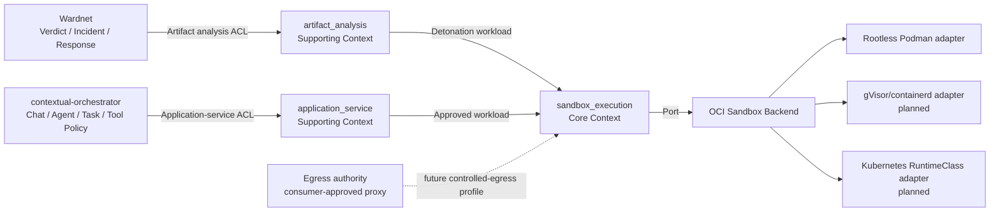
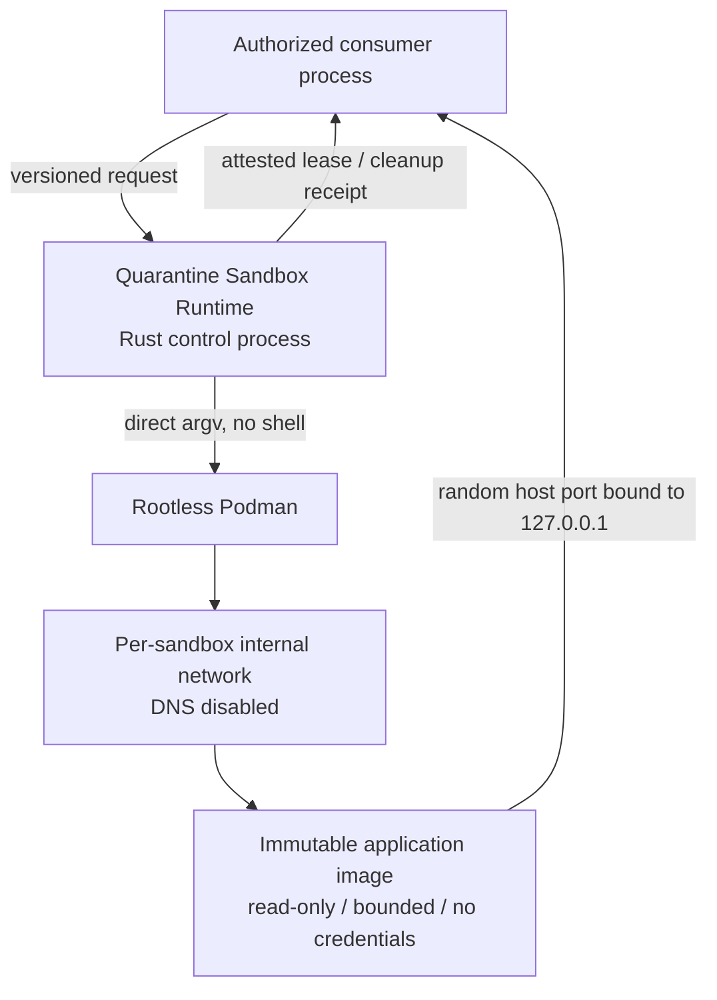

# Architecture

## Architectural goal

Provide one reusable, independently deployable isolation runtime that can safely execute **hostile analysis workloads** and **consumer-approved application services** without absorbing consumer business authority.

## Bounded contexts

### `sandbox_execution` — Core subdomain

Ubiquitous Language:

- **Isolation Policy:** operator-owned maximum authority/resource envelope.
- **Resource Request:** consumer-requested resources constrained by policy.
- **Sandbox:** one isolated workload instance.
- **Lease:** time-bounded evidence that a ready sandboxed service exists.
- **Endpoint:** consumer-visible loopback address for a leased application service.
- **Isolation Attestation:** runtime facts about the security boundary actually requested/enforced by the profile.
- **Cleanup Receipt:** evidence that runtime-owned container/network resources were removed.

Responsibilities:

- validate isolation policy/resource budget;
- create/identify sandbox resources;
- supervise lifetime/readiness;
- produce endpoint/attestation/cleanup evidence;
- isolate backend implementation behind the runtime boundary.

### `artifact_analysis` — Supporting subdomain

Ubiquitous Language:

- **Artifact:** immutable hostile bytes.
- **Analysis Profile:** requested static/dynamic analysis depth.
- **Analyzer:** one evidence producer.
- **Evidence Bundle:** ordered deterministic evidence plus completeness.
- **Runtime Disposition:** completed/inconclusive/failed analysis completeness, never maliciousness.

Responsibilities:

- bounded ingestion and immutable identity;
- non-executing format classification;
- analyzer orchestration;
- attributable analyzer failures;
- future detonation requests through `sandbox_execution`.

### `application_service` — Supporting subdomain

Ubiquitous Language:

- **Application Service Request:** consumer-neutral intent to start one authorized immutable OCI image.
- **Service Lease:** ready loopback endpoint plus runtime attestation and expiry.

Responsibilities:

- validate digest-pinned application/service intent;
- translate allowed resources/protocol into Core sandbox execution;
- return consumer-neutral lease/cleanup contracts.

It does not select or authorize the application for an Agent.

## Context Map

Relationship semantics:

- Wardnet is an **upstream consumer** and verdict authority, not a parent module.
- `contextual-orchestrator` is an **upstream consumer** and Agent/tool authorization authority.
- External consumer models are isolated through ACLs.
- Podman/gVisor/containerd/Kubernetes are infrastructure adapters; their models never cross into consumer domain contracts.
- Egress is intentionally absent from P0; future egress is a separate explicit contract.

## Dependency rules

1. `artifact_analysis` and `application_service` may depend on public Core sandbox concepts; they do not depend on each other.
2. Core/domain contracts do not depend on Wardnet, contextual-orchestrator, Podman CLI structs, Kubernetes objects, web frameworks, or persistence DTOs.
3. Infrastructure adapters implement Core execution semantics and may depend on platform tooling.
4. `lib.rs` is a public facade, not a domain container.
5. No direct foreign application-database access.
6. No sibling source checkout required for build or operation.

## Current deployment view

For artifact static analysis, there is no application container. Future dynamic artifact detonation reuses or strengthens Core isolation rather than executing content in the Rust control process.

## Security invariants

- P0 application image is immutable digest-pinned and locally present; no launch-time pull.
- P0 backend must prove rootless mode.
- P0 root filesystem is read-only and writable tmpfs is explicit/bounded.
- No ambient consumer/provider credentials.
- No privileged mode, host networking/PID/IPC, runtime sockets, host devices, or broad host mounts.
- P0 service publication is IPv4 loopback only.
- P0 network is internal and DNS-disabled; arbitrary external egress is not a request capability.
- CPU/RAM/PID/tmpfs/lease/readiness/shutdown limits are bounded by operator policy.
- A lease is returned only after readiness.
- Uncertain cleanup is a failure.
- Static analysis never asserts observed runtime behavior.

## Persistence

The current runtime owns **no durable database**. Evidence, leases, and receipts are in-process return values. Any future durable job/evidence/reaper store requires an explicit persistence ADR, 3NF schema, descriptive multiword `snake_case` objects, retention/recovery semantics, and a migration path. Consumer databases remain consumer-owned.

## Future extraction threshold

Do not split a new repository merely because more backends exist. Consider extraction only when a stable responsibility has independent buyer/runtime lifecycle, deployment/security boundary, release cadence, or multiple unrelated products that cannot reasonably share one modular runtime artifact.
