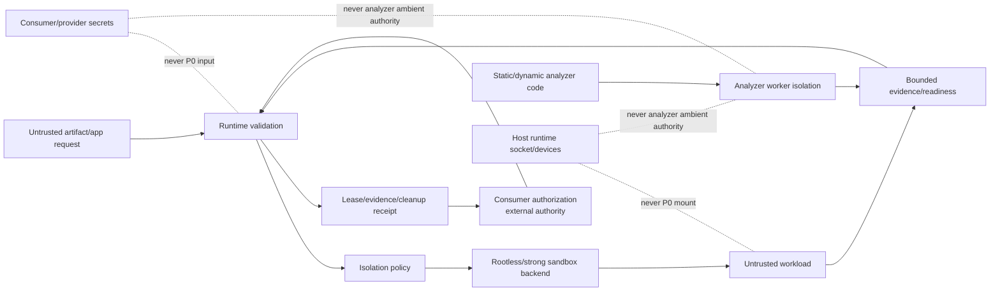

# Threat Model

## Assets

- host kernel and filesystem;
- consumer credentials and provider secrets;
- Agent/chat task authority;
- security verdict/incident authority;
- immutable application/artifact identity;
- analysis evidence and runtime attestation;
- CPU, RAM, PID, storage and network capacity;
- container backend control plane;
- loopback service endpoint and lease identity.

## Adversaries

- malicious artifact author;
- malicious or compromised application image;
- prompt-injected Agent observation attempting to request broader runtime authority;
- compromised/buggy consumer submitting malformed or excessive requests;
- compromised analyzer/backend returning misleading output or attempting to use runtime-host capabilities;
- local unprivileged attacker attempting to interfere with runtime resources;
- supply-chain attacker replacing dependency, action, analyzer, or application image.

## Trust-boundary diagram

## STRIDE-style threats and controls

### Spoofing

- **Mutable image tag presented as stable identity:** reject; require SHA-256 digest.
- **Backend claims rootless while running privileged:** P0 probes rootless; real E2E and later backend attestation must verify effective runtime state.
- **Analyzer reports another producer identity:** failure/evidence attribution binds configured producer identity; reported metadata remains untrusted.
- **Consumer reuses another task's lease:** request/lease IDs are opaque and consumers must bind them to their own authorized session/task; stale/expired lease rejection is a consumer ACL requirement.

### Tampering

- **Artifact bytes mutate during analysis:** immutable in-process bytes plus SHA-256 identity.
- **Application image changes between authorization and launch:** immutable digest plus `--pull=never`.
- **Sandbox request raises limits:** operator `IsolationPolicy` is authoritative; consumer request is bounded below it.
- **Infrastructure name injection:** container/network names are derived from SHA-256, not raw request text.
- **Shell injection through command args:** direct `Command` argv; no shell.
- **Analyzer fabricates boundary evidence:** analyzer result data is untrusted; runtime isolation evidence must come from the worker/backend boundary tied to the exact analyzer and artifact, not analyzer self-report or hard-coded booleans.

### Repudiation

- **Consumer disputes which image/policy ran:** versioned lease records request, image, backend, policy, endpoint, start/expiry and isolation facts.
- **Cleanup is assumed without evidence:** success requires explicit cleanup receipt; failures are not rewritten as success.
- **Analysis provenance lost:** deterministic evidence IDs/order and producer attribution.
- **Static analyzer claims no host capability use without proof:** no-network/no-credential/no-execution evidence requires exact-worker isolation proof; an in-process trait call is not attestation.

### Information disclosure

- **Secrets leak into workload:** no P0 secret/env/mount capability.
- **Secrets leak into analyzer:** static and dynamic analyzer workers receive no consumer/provider secret or arbitrary ambient environment capability.
- **Host files leak:** read-only image plus bounded tmpfs; no arbitrary host-path mount.
- **Runtime socket leaks host control:** no Docker/Podman/containerd socket request or mount.
- **Analyzer reaches host filesystem/runtime sockets:** analyzer workers receive only the exact immutable artifact/input and bounded scratch/output channels; broad host paths and runtime sockets are denied.
- **Backend diagnostics echo hostile data:** errors use stable codes; future captured output must remain bounded and sanitized.
- **Service becomes externally reachable:** publication is only `127.0.0.1` and returned mapping is validated.

### Denial of service

- **CPU/RAM/PID exhaustion:** explicit limits within operator maxima.
- **Unbounded temporary storage:** bounded tmpfs.
- **Long-running application:** lease/container timeout plus consumer termination; durable orphan reaper is a GA gap.
- **Readiness hangs:** bounded timeout/poll interval.
- **Excessive artifacts/metadata:** ingestion/context limits.
- **Analyzer resource exhaustion:** analyzer worker CPU/RAM/PID/time/output/storage are independently bounded; artifact parser faults or hangs must be attributable and fail closed/inconclusive.
- **Container/backend process storm:** one sandbox per accepted request and PID/resource policy; concurrency/admission control is a future operability slice.

### Elevation of privilege

- **Privileged container/capability escalation:** no privileged request surface, all capabilities dropped, no-new-privileges.
- **Host namespace access:** isolated user/PID/IPC/UTS/cgroup namespaces and internal network.
- **Device/GPU access:** no P0 device passthrough.
- **Analyzer code runs in the runtime host process:** prohibited for production evidence paths. A compromised or vulnerable analyzer must execute behind an enforceable capability boundary; Rust trait/type boundaries alone do not remove host socket/environment/filesystem/process authority.
- **Container escape through kernel vulnerability:** rootless containment reduces impact but does not remove shared-kernel risk; stronger gVisor/VM adapter is required for higher-risk profiles.
- **Agent prompt injection asks sandbox for secrets/network:** Chat/Agent consumer authorization is separate, and P0 contract has no such fields.

## Key abuse cases

### Application tries Internet exfiltration

Expected result: no externally routed P0 network path. Real-container E2E must verify this. A controlled-egress profile is a separate future contract and cannot be enabled by application input.

### Application tries to modify image filesystem

Expected result: read-only rootfs denial; only explicit bounded `/tmp` is writable. E2E must verify `/tmp` is noexec and rootfs writes fail.

### Application forks indefinitely

Expected result: PID and CPU/memory limits constrain the workload; inability to enforce a requested limit fails closed.

### Static analyzer attempts runtime-host network access

Expected result: the analyzer cannot connect to the runtime host's loopback/Internet path because production analyzer execution is isolated from host networking. A returned evidence bundle may state `network_access_performed=false` only when that denial is enforced and bound to the exact worker. Issue #49 is the current RED for this boundary.

### Consumer passes `--privileged` as application argument

Because application args are appended **after** image identity, they are application argv and cannot become Podman flags. Consumer contract does not expose raw Podman option injection.

### Runtime crashes after launch

Podman timeout bounds application process lifetime, but stale container/network cleanup is not fully guaranteed. Durable lease/orphan reclamation is a release-blocking gap before GA.

## Residual risks

- shared-kernel container escape vulnerabilities;
- host-specific rootless/cgroup/network behavior;
- supply-chain trust of an immutable but malicious image or analyzer package;
- loopback service vulnerability exploitable by another local process;
- process crash before cleanup producing stale isolation objects;
- no authenticated IPC/API layer in the current library foundation;
- no controlled secret capability for applications that legitimately require credentials;
- analyzer worker isolation is not yet implemented on the active foundation; current in-process `StaticAnalyzer` execution is issue #49 and cannot support production no-network/no-credential attestation.

These risks must be addressed by stronger adapters, analyzer-worker isolation, admission policy, local identity/IPC controls, durable reaping, and explicit capability brokers rather than weakening the P0 sandbox.